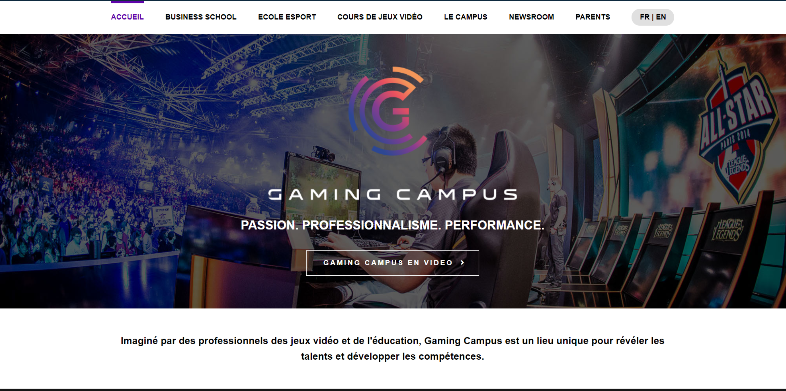

# 🎮 TP - Gaming Campus

> Intégration d'une landing page fictive pour une école de jeux vidéo.

## 📄 À propos
Ce projet est une intégration statique réalisée en **HTML** et **CSS**. Il s'agit de la reproduction d'une maquette pour "Gaming Campus", un projet fictif d'école e-sport et jeux vidéo.

L'objectif principal était de mettre en pratique les fondamentaux de l'intégration web : structure sémantique, positionnement (Flexbox) et stylisation.

## 🎓 Contexte du projet
Ce travail a été réalisé dans le cadre de la formation du YouTubeur **FromScratch**. Il s'agit de l'un de mes tout premiers projets de développement.

> **Note sur l'historique :**
> Ce dépôt témoigne de mes débuts en programmation. L'historique de commits est volontairement succinct car je n'avais pas encore acquis les bonnes pratiques de versionning (Git) au moment du développement, l'accent étant mis prioritairement sur l'apprentissage du HTML/CSS.

## 🛠️ Technologies utilisées
* **HTML5** : Structure sémantique de la page.
* **CSS3** : Mise en forme, gestion des polices et des couleurs.
* **Google Fonts** : Typographie.

## 🚀 Comment visualiser le projet ?
Puisqu'il s'agit d'un site statique, aucune installation complexe n'est requise.

1.  Clonez ce dépôt (ou téléchargez le ZIP).
2.  Ouvrez le fichier `index.html` dans votre navigateur.

## 🖼️ Aperçu

## 👤 Auteur
Projet réalisé par moi-même dans le cadre d'un exercice pédagogique.